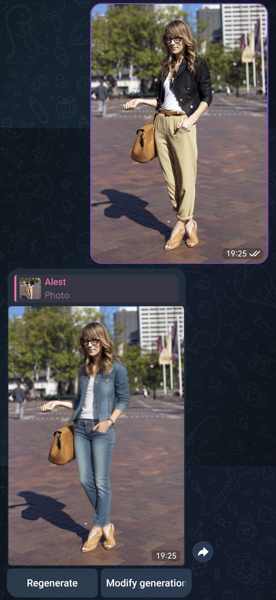
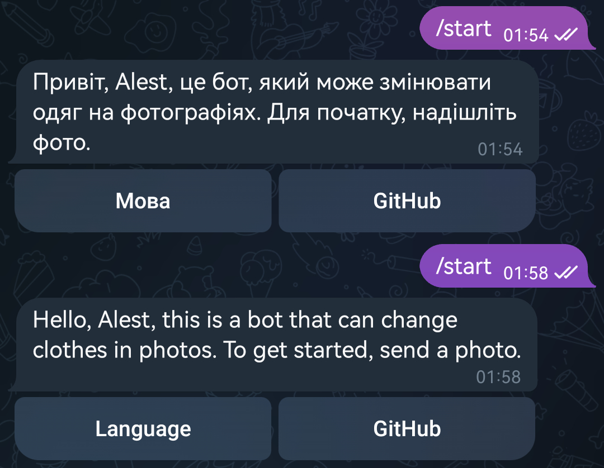
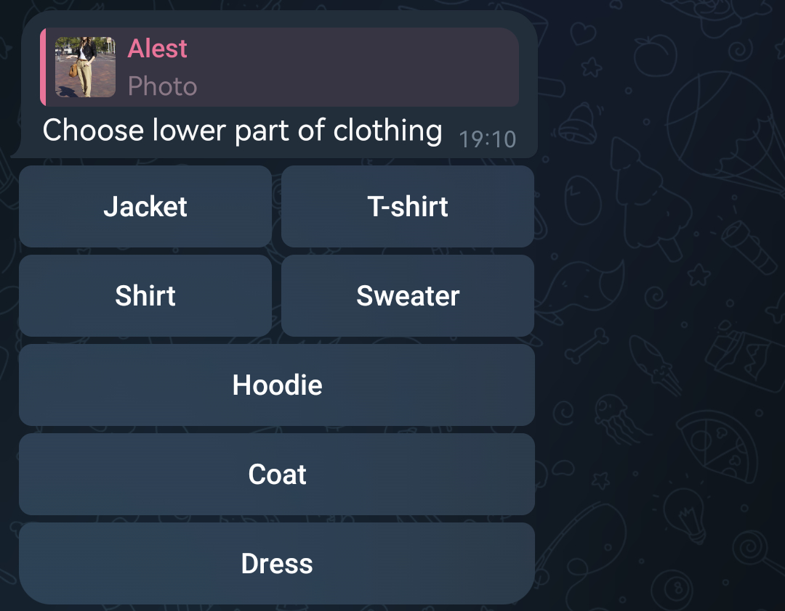
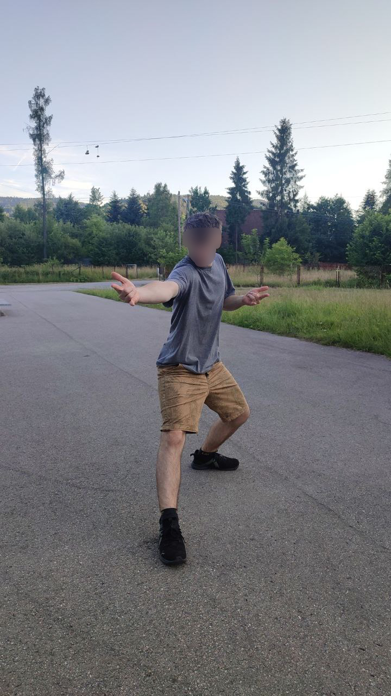
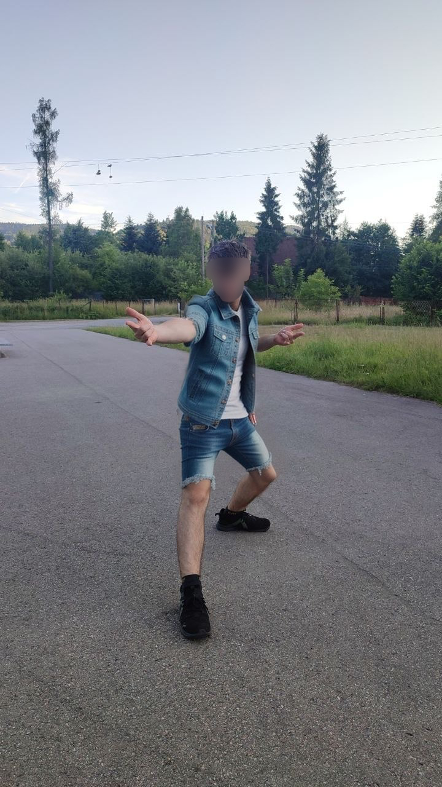
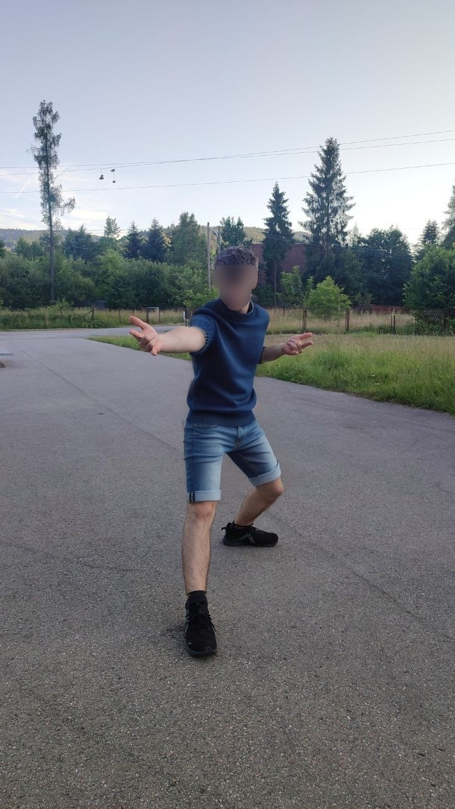
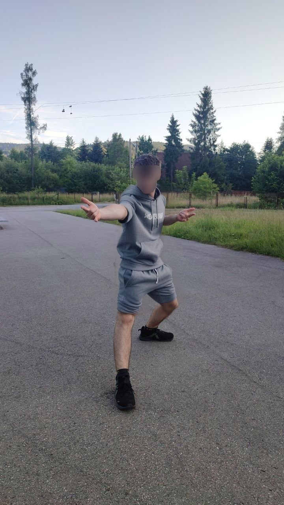

# Clothing Bot
This project is a distributed Telegram bot system that allows users to chage clothes on a photo. It combines custom computer vision models for precise clothing segmentation with Stable Diffusion for realistic inpainting.

    <figure>
        

            
        

        <figcaption><i>Example of a generated result.</i></figcaption>
    </figure>

 

    
<b>View Interface Screenshots</b>

    

         
        <figure>
            

                
            

            <figcaption><i>Multi-language support for localized user experiences.</i></figcaption>
        </figure>
          
        <figure>
            

                
            

            <figcaption><i>Customization for clothing type, color, and style.</i></figcaption>
        </figure>
          
        <figure>
            

                
            

            <figcaption><i>Interface for selecting specific garment attributes.</i></figcaption>
        </figure>
          
        <figure>
            

                
            

            <figcaption><i>Real-time generation status with task control options.</i></figcaption>
        </figure>
          
        <figure>
            

                
            

        </figure>
        <figure>
            

                
            

            <figcaption><i>System feedback for error handling.</i></figcaption>
        </figure>
    

    
<b>View Generations Screenshots</b>

    

        <figure>
            

                
            

            

                <figcaption><i>Input Generation</i></figcaption>
            

        </figure>
		 
        <figure>
            

                
            

        </figure>
        <figure>
            

                
            

        </figure>
        <figure>
            

                
            

        </figure>
        <figure>
            

                
            

        </figure>
        <figure>
            

                
            

        </figure>
        <figure>
            

                
            

        </figure>
        <figure>
            

                
            

        </figure>
        <figure>
            

                
            

        </figure>
        <figure>
            

                
            

        </figure>
        <figure>
            

                
            

        </figure>
        <figure>
            

            	<figcaption><i>Output Generations</i></figcaption>
            

        </figure>
    

	   
    

        <figure>
            

                
            

            

                <figcaption><i>Input Generation.</i></figcaption>
            

        </figure>
		 
        <figure>
            

                
            

        </figure>
        <figure>
            

                
            

        </figure>
        <figure>
            

                
            

        </figure>
        <figure>
            

                
            

        </figure>
        <figure>
            

                
            

        </figure>
        <figure>
            

            	<figcaption><i>Output Generations.</i></figcaption>
            

        </figure>
    

	   
    

        <figure>
            

                
            

            

                <figcaption><i>Input Generation. Face blurred for privacy.</i></figcaption>
            

        </figure>
		 
        <figure>
            

                
            

        </figure>
        <figure>
            

                
            

        </figure>
        <figure>
            

                
            

        </figure>
    

	<figure>
		

			<figcaption><i>Output Generations. Face blurred for privacy.</i></figcaption>
		

	</figure>
	   
    

        <figure>
            

                
            

            

                <figcaption><i>Input Generation. Face blurred for privacy.</i></figcaption>
            

        </figure>
		 
        <figure>
            

                
            

        </figure>
        <figure>
            

                
            

        </figure>
        <figure>
            

                
            

        </figure>
    

	<figure>
		

			<figcaption><i>Output Generations. Face blurred for privacy.</i></figcaption>
		

	</figure>

## Project Overview
The system is architected as a distributed network of specialized services to handle high-compute AI tasks:
1.  **[Telegram Bot](./telegram)**: The user interface, built with `aiogram`. It manages user preferences (clothing type, color, style), image uploads, and handles a generation queue.
2.  **[Backend Server](./backend)**: A FastAPI-based service that performs the heavy lifting:
    - **Segmentation**: Uses a custom-trained **YOLOv8x** model to generate precise skin and clothing masks .
    - **Face Protection**: Employs **MediaPipe** to detect and mask out the face, ensuring the person's identity remains untouched during inpainting.
    - **Inpainting**: Communicates with the Stable Diffusion WebUI (Forge) to generate the new clothing based on user-selected prompts.
3.  **[A1111 (Stable Diffusion)](./a1111)**: A dedicated instance of Stable Diffusion WebUI Forge optimized for inpainting using the `Realistic Vision V6.0 B1 HyperInpaint` model.

## Technical Stack
- **Hardware**: NVIDIA GPU (8GB+ VRAM recommended, tested on RTX 3060 12GB)
- **Containerization**: Docker, Dockerfile
- **Computer Vision**: YOLOv8 (Ultralytics), MediaPipe, OpenCV, NumPy
- **Generative AI**: Stable Diffusion WebUI (Forge), ControlNet (OpenPose)
- **Backend & API**: FastAPI, Uvicorn, Aiohttp
- **Bot Framework**: Aiogram 3.x
- **Database**: MongoDB (for user state and generation history)
- **Annotation Tools**: ISAT with Segment Anything, Segment-Anything-Annotator

## Deployment
The entire system is containerized using **Docker** to ensure consistency across different environments. Each component (Telegram Bot, Backend, and A1111) has its own  `Dockerfile`, allowing for easy scaling and deployment of multiple backends to handle increased load.

## Core Features
- **Precise Clothing Segmentation**: Custom YOLOv8x model trained on 600+ high-quality annotated images for identifying clothing and skin.
- **Identity Preservation**: Automatic face detection and masking to prevent AI from altering the user's facial features.
- **Distributed Generation Queue**: A multi-threaded queue system that can distribute requests across multiple GPU backends for improved throughput.
- **Customizable Styles**: Users can select specific clothing types, colors, and overall styles (casual, sport, formal, etc.) through an intuitive Telegram inline menu.
- **Pose-Guided Inpainting**: Integrates OpenPose via ControlNet to ensure the generated clothing naturally follows the person's body structure.
- **Multi-Language Support**: The bot interface supports multiple languages, currently featuring **English** and **Ukrainian**, with an extensible architecture for adding more.

## Lessons
- **Model Training**: Initially, a YOLOv8l model trained on 300 images wasn't accurate enough. Upgrading to **YOLOv8x** and expanding the dataset to 600 images with stricter quality control significantly improved segmentation.
- **Annotation Workflow**: Finding the right tools was key. `ISAT_with_segment_anything` proved to be the most efficient for high-quality segmentation labeling experience.
- **Stable Diffusion Tuning**: Even with a "pixel-perfect" mask, inpainting settings (denoising strength, sampler, CFG scale) are critical. The `Realistic Vision HyperInpaint` model was found to provide the best balance for realistic clothing.
- **Race Conditions**: Encountered a complex bug where concurrent users caused duplicate generation requests. This highlighted the importance of thread-safe queue management in distributed systems.
- **Hyperparameter Defaults**: Experimenting with custom YOLOv8 training parameters often led to worse results; the default Ultralytics parameters are remarkably well-optimized for general segmentation.

## Project Status
Currently no longer being updated. Previously hosted and accessible via Telegram at https://web.telegram.org/k/#@alest_clothing_bot.
